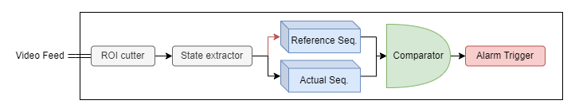

# IPCam

## TO-DO List:
### Idees:
- QRubberBand per seleccionar part de l'imatge
- Bloquejar ipLine si s'esta conectat
- Exepcio si ipline is not ipv4
### UI
- Definir 100% UI (Sobretot PTZ i followers)
- Passar tot MainWindow enlloc de widgets un a un
- Predefinir tipus a les funcions
- Popping widget per modificar configuració de la càmara.
### Programari
- ~~etc/FastCam Programa cmd per descobrir ip de la càmera i obrir vlc~~
- Arxius de configuració? Parametres?
- Automatizar Documentació 
- Esquema general (organització en directoris y UML)
- Petit README
- Definir gestió de versions?
- Establir com es fara l'executable (Makefile, requirements.txt, etc)
### Modul PTZ
- Definir com funcionara PTZ y ¿PTZVector?
    ```python
    # Crear objeto PTZVector
    ptz_vector = client.get_type('ns0:PTZVector')  # Reemplaza 'ns0' con el namespace adecuado
    ```
### Modul Discovery
- Definir retorn de funció (diccionari o llista?)

### Modul Follower
- Serveix per fer el seguiment de elements. (p.e: leds, pantalles, bombetes, motors...)
- Un petit esquema de com podria funcionar:
<p align="center">

</p>


## Avanços:
### A dia 27/05/2023:
- Es té un quadre de diàleg per presentar informació i errors
- Es descobreixen les cameres accesibles mitjançant un broadcast UDP, en cas de descobriment, es canvia la ip automàtiament.
- Es possible presentar l'imatge en directe d'una WebCam
- Els controls per conectar-se i desconectarse mitjançant un client SOAP-Onvif a certa IP estàn preparats
<p align="center">

</p>

