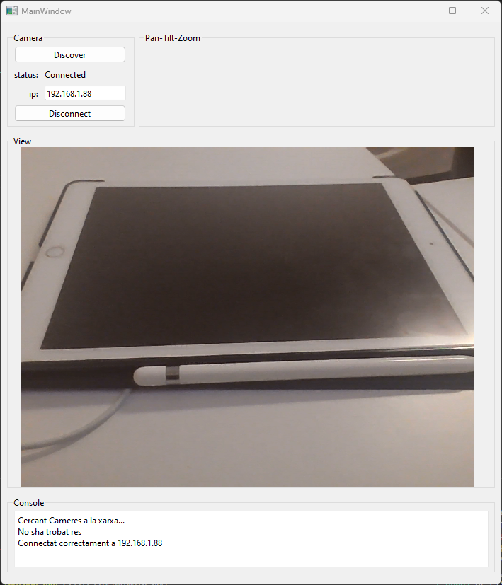

# IPCam

## Avanços:

### A dia 27/05/2023:
- Es té un quadre de diàleg per presentar informació i errors
- Es descobreixen les cameres accesibles mitjançant un broadcast UDP, en cas de descobriment, es canvia la ip automàtiament.
- Es possible presentar l'imatge en directe d'una WebCam
- Els controls per conectar-se i desconectarse mitjançant un client SOAP-Onvif a certa IP estàn preparats

