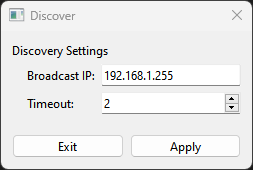
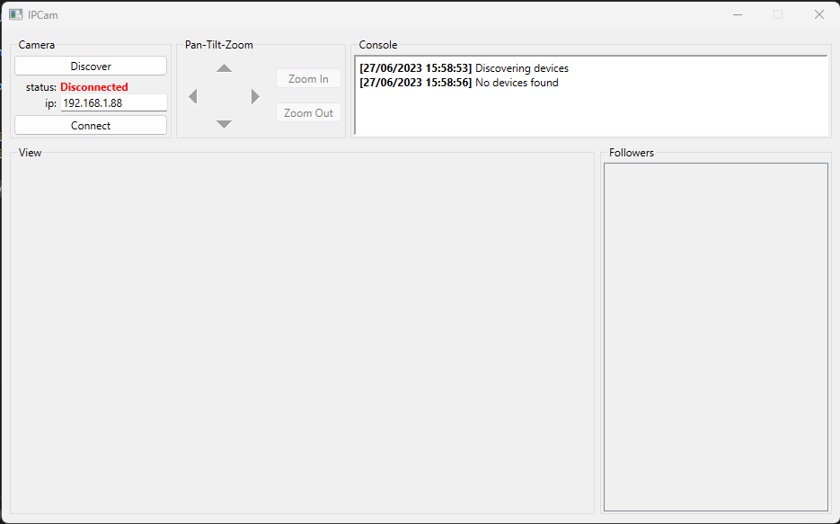
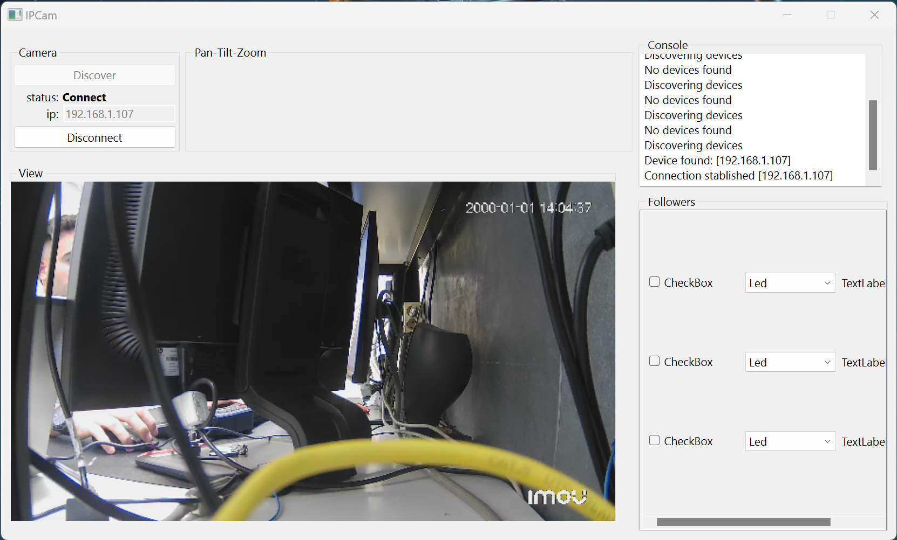
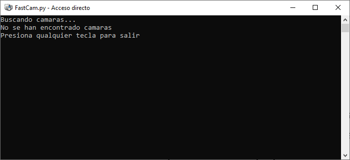

# IPCam

## Idees Marc:
- 

## Idees:
- QRubberBand per seleccionar part de l'imatge
- prints() per informar de debug
- Console.afegirMissatge() per informar al usuari
- JSON de configuració (darrer broadcast, timeout, darrera IP)
- JSONs per credencials
  
## TO-DO List:

### Alta prioritat:
- Esquema general (UML)
- Investigar diferents protocols de streaming disponibles

### Device Manager:
- Hora no funciona bé, falta gestionar TZ.
- Revisar que es pot cambiar tot
  
### FollowersBox
- Definir UI followers 
- Definir creació de followers (a Mainwindow.py hi ha un exemple)

### PTZController
- Threat a PTZController que envii els request de moviment.

### CameraBox
- Test de bugs conex/desconex
- Comprovar IP valida
- Gestionar excepcions

### Mòdul CameraClient
- Gestió de contrasenyes i usuaris
  
### Mòdul FeedBox
- Emprar Signal de conexió per començar Feed
- Signal de desconexió quan es perd el streaming
- Treure feed al desconectar
- Gestió de Zoom In/Out digital
  
### Mòdul Follower
- Serveix per fer el seguiment de elements. (p.e: leds, pantalles, bombetes, motors...)
- Un petit esquema de com podria funcionar:
<p align="center">

</p>

## Avanços:

### A dia 10/07/2023:
- Es possible accedir a l'informació proporcioanda per la càmara prement Device->Device Management
- Es pot cambiar la configuració per descobrir càmeres a la xarxa. Aquesta, juntament amb la darrera IP a la que s'ha conectat el software queda guardada al arxiu config/connection_settings.json
- Aquest esquema de configuració amb arxius JSON es replicara per la resta de dades a emmagatzemar
```json
{
  "ip": "0",
  "Broadcast IP": "192.168.1.255",
  "Discovery time": 2
}
```
<p align="center">

</p>

### A dia 29/06/2023:
- Moviment de la càmara funcionant
- Actuialitzacio UI (PTZ i Zoom)
- build/build.py per generar la distribució de l'executable
- Aquesta primera versió queda instalada a l'ordinador del laboratori
<p align="center">

</p>

### A dia 07/06/2023:
- Es pot rebre el streaming d'una càmera trobada a la xarxa
- Si s'intenta conectar a una IP no vàlida, es mostra un error a la consola
- Quan una camera està conectada, no es deixa ni canviar la IP ni descobrir-ne de noves
- Actuialització de la UI, es presenta com podrien estar mostrats els "Followers"
<p align="center">

</p>

### A dia 27/05/2023:
- Es té un quadre de diàleg per presentar informació i errors
- Es descobreixen les cameres accesibles mitjançant un broadcast UDP, en cas de descobriment, es canvia la ip automàtiament.
- Es possible presentar l'imatge en directe d'una WebCam amb OpenCV
- Els controls per conectar-se i desconectarse mitjançant un client SOAP-Onvif a certa IP estàn preparats
<p align="center">

</p>

### A dia 25/05/2023:
- Es fa un script "FastCam" ubicat a etc/FastCam per trobar una camara a la xarxa, i obrir el reproductor VLC amb el streaming d'aquesta.
- Es deixa l'script preparat al ordinador de la càmara FAR per realizar els assaigos d'inmunitat.
<p align="center">

</p>
